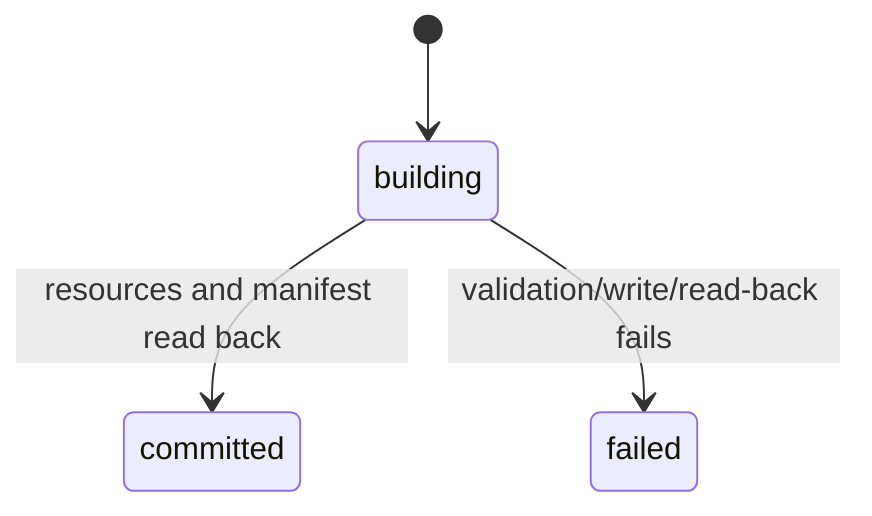

# Design: Phase 2 — Atomic Publication

## 1. Technical approach

`Generation_Publisher.js` is the sole commit boundary (§1D, PUB-7, OWN-8): Finaliser stages events, Compiler stages legs/itinerary, and Publisher validates, reorders, version-writes, then switches the manifest.

## 2. Architecture decisions

| Decision | Choice / rationale | Rejected / trade-off |
|---|---|---|
| Publisher | New module keeps Compiler assembly-only; matches SCRIPT-15. | Rename: smaller, mixed ownership. |
| Split | Finaliser validates; Compiler assembles; Publisher commits/prunes. | Publisher rebuilding domains. |
| Manifest | Private Publisher function preserves one writer. | Separate writer obscures RULE-8A. |
| Reads | `TDS_Helper.readActiveGeneration(kind)`; setter removed; Tasker invokes before readers. | Inline copies drift. |
| Reorder | Local queue `tds_reorder_commands`; serial producers, Publisher consumer. | File races; global stales; `par1` is singular. |
| Identity | `gen:<10digit>:<4hex>`; retry collision; encode colons as underscores. | Counter/ULID/UUID drift. |
| Atomicity | `building→committed|failed`; manifest-last/read-back. | Rename/WAL unavailable; eventual consistency. |
| Retention/logs | `PHASE2_RETENTION=5` post-commit; set active global after success. | Time/all retention; arguments. |
| Events/migration | Versioned events; one-release backups; one-shot cutover. | Hybrid sources. |
| Enforcement | Read-only helper, harness inventory, review. | Review-only gaps. |

## 3. Data flow

```mermaid
sequenceDiagram
 Alpha->>Finaliser: ingest
 Finaliser->>Compiler: validated events
 Compiler->>Gatekeeper: cluster
 Gatekeeper-->>Compiler: reorder command
 Compiler->>API_Parser: route
 API_Parser-->>Compiler: reorder command
 Compiler->>Generation_Publisher: three candidates
 Generation_Publisher->>Files: validate; events→master→itinerary→manifest
 Dispatcher->>TDS_Helper: committed itinerary
 Dashboard->>TDS_Helper: committed itinerary
```



Command: `APPLY_CLUSTER_REORDER {generationId,clusterId,orderedEventIds,source,emittedAt}`. Validate exact/unique IDs, generation, cluster, day (§12); snapshot before master write. Serialize; reject stale commands and regenerate.

Manifest: `{schemaVersion,activeGeneration,previousGeneration,publishedAt,writer,eventsPath,masterPath,itineraryPath,eventCount,legCount,itineraryCount,state}`; paths and counts.

## 4. Procedures

```text
PUBLISH(candidate)
 validate schemas, generation/policy/day/chain/duration/completion, and counts; else FAIL
 mint unused ID; hold building manifest in memory; clear active global
 write+read-back events; apply reorder snapshot
 write+read-back master; write+read-back itinerary
 write committed manifest last; read-back exact paths/counts/state
 prune beyond newest five using Publisher-owned Tasker delete action
 setGlobal(TDS_Active_Generation,id)
FAIL
 log GENERATION_VALIDATION_FAILED; clear global; mark failed
 attempt failed recovery manifest pointing active/previous to prior readable generation
 if manifest write fails, prior bytes remain; stop writes; never prune
```

`building` is in-memory. Resource failure may write only recovery `failed`; manifest failure leaves prior bytes. Prune failure cannot revoke commit; log/retry.

```text
READ(kind)
 parse TDS_Run_Manifest.json; require committed; read its exact kindPath
 on manifest/resource failure use cached last-readable manifest or declared previous
 otherwise return []; Dispatcher uses idle sync
```

Manifest is restart authority; global is logging-only. Writes may tear; read-back detects where possible and retention recovers, without rename/durability guarantees.

## 5. File-change contract

| File/function | Change / risk | Requirements |
|---|---|---|
| `Generation_Publisher.js` new | Mint, validate, publish, prune, migrate / High | all additions, PUB-7, OWN-8 |
| `Finaliser.js` top-level | Stage events; helper prior-read; remove write / High | discovery, RULE-8A, §1A |
| `Compiler.js` IIFE | Stage master/itinerary; remove write / High | schema, order, OWN-8 |
| `Alpha.js` top-level | Remove 392–393; no other master writes / Low | RULE-8A |
| Gatekeeper `sortMasterJson` | Remove 56; emit command / Medium | RULE-8A, §12 |
| API Parser `sortMasterJson` | Remove 33; emit command / Medium | RULE-8A, §12 |
| `TDS_Helper.js` | Read-only resolver/fallback; reject setter / High | discovery, OWN-8 |
| Dispatcher top-level | Helper read; idle fallback / High | discovery, PUB-7 |
| Dashboard top-level | Helper read; empty fallback / Medium | discovery, PUB-7 |
| Sandbox reads | Helper events/prior itinerary / High | discovery |
| `harness/mock_tasker.js` | Inject failures/order/delete / Low | VAL-18 |
| `harness/test_atomic_publication.js` new | Contract scenarios / Low | requirements below |

## 6. Placeholder inventory

The “11” is stale: source has **15 expressions**; all read `global('TDS_Active_Generation')`.

| File/function | Line: current emission |
|---|---|
| Compiler `rejectZero` | 50: zero duration |
| API Parser IIFE | 99: invalid metrics; 139: exception |
| Sandbox run / `enqueuePlannedRow` | 281: synthetic return; 462: policy; 533: live base; 1027: format; 1041: suffix; 1361: future trip |
| `ID_Parser._reject` | 37: ID rejection |
| Dispatcher run | 123: duration; 139: distance; 156: stale; 348: idle |
| Override Handler `rejectId` | 36: ID rejection |

## 7. Migration, verification, scope

First run validates legacy master/events and itinerary/legs, backs up as `.legacy.json`, version-publishes, then commits. Readers cut together. Rollback restores names before disabling publication.

VM mocks support corrupt reads, thrown writes, ordering, globals, deletion. Tests cover ID/collision/encoding; lifecycle/schema/counts; each write failure/order; active/prior/empty reads; 15 placeholders; ownership; reorder timing; retention; migration/rollback; PUB-7 no-partial activation—every addition plus PUB-7/OWN-8.

Threat matrix rows (documentation paths, Git selection, commit, push, PR) are **N/A**: no classification, shell, VCS, or PR boundary. Tasker sequencing is tested above.

Out: rename, append-only audit, trip-state migration (P3), general protocols (P5), Alpha cleanup (P6). No blocker; device-check deletion and single-call writes.
